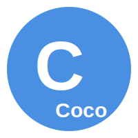

#coco


---

# **Coco Programming Language**

 


## **How to create coco**

### **1. Core Concepts of Programming Language Design**

Creating a programming language from scratch involves a deep understanding of the various stages of compilation and interpretation:

#### **1.1. Lexical Analysis**
Lexical analysis is the process of converting a sequence of characters into a sequence of tokens. A token is a meaningful sequence of characters, like keywords (`if`, `for`), identifiers (variable names), literals (numbers, strings), and operators (`+`, `-`). The lexical analyzer reads the source code character by character and groups them into tokens. This phase is critical because the tokens serve as the building blocks for the next stages of the language's compilation process.

#### **1.2. Parsing**
Parsing is the next step, where the sequence of tokens is transformed into an Abstract Syntax Tree (AST). The AST is a tree representation of the syntactic structure of the source code. Parsing uses a formal grammar (often expressed in Backus-Naur Form, BNF) to ensure that the tokens are arranged in a valid sequence according to the language's rules. For instance, in a simple expression like `a + b * c`, the parser needs to recognize the precedence of operations and generate an AST that reflects this, typically with the multiplication happening before the addition.

#### **1.3. Semantic Analysis**
Once the AST is generated, the semantic analysis phase checks for semantic errors, which go beyond syntax. This involves type checking (ensuring that operations are performed on compatible data types), scope resolution (making sure that variables are defined before they are used), and other checks like ensuring that function calls match their definitions. For example, a language might prevent adding an integer to a string, and the semantic analyzer would catch this mistake.

#### **1.4. Intermediate Code Generation**
After ensuring that the code is syntactically and semantically correct, the next step is generating intermediate code. This code is often platform-independent and represents a step between high-level source code and machine code. The Intermediate Representation (IR) is crucial for optimization because it abstracts away some of the complexities of machine code while still being closer to the hardware than the original source code. This stage allows for optimizations like loop unrolling and constant folding before the code is translated into machine-specific instructions.

#### **1.5. Optimization**
Optimizations are transformations applied to the intermediate code to improve performance without changing the program's behavior. Some common optimization techniques include:
- **Inline Expansion**: Replacing function calls with the actual code of the function to eliminate the overhead of a call.
- **Loop Unrolling**: Expanding the loop body to reduce the number of iterations and hence, the loop overhead.
- **Dead Code Elimination**: Removing parts of the code that do not affect the program's outcome.
- **Constant Folding**: Evaluating constant expressions during compilation instead of at runtime to speed up execution.

#### **1.6. Code Generation**
The optimized IR is then translated into machine code, which is specific to the architecture (x86, ARM, etc.) on which the program will run. Code generation must account for the architecture's instructions, registers, memory management, and calling conventions.

#### **1.7. Linking and Assembly**
Finally, the generated machine code is linked with other code modules (libraries, other compiled code) to produce an executable. The assembly step converts the machine code into a format that can be executed by the hardware.

### **2. Defining the Language’s Purpose**

When designing a language, it's crucial to have a clear understanding of its intended use case:

#### **2.1. Domain-Specific vs. General-Purpose**
- **Domain-Specific Languages (DSLs)** are designed for specific tasks, like SQL for database queries or Verilog for hardware description. These languages are highly optimized for their niche but are limited in scope.
- **General-Purpose Languages** like Python, C++, or Java, are versatile and can be used for a wide range of applications, from web development to system programming. If your goal is to create a language better than Python, you're likely aiming for a general-purpose language that balances ease of use with performance.

#### **2.2. Performance Goals**
- **Low-Level Access**: A language like C allows fine-grained control over memory and hardware, which is essential for systems programming and performance-critical applications.
- **High-Level Abstractions**: Python, on the other hand, provides high-level abstractions, making it easier to write complex programs quickly but at the cost of performance. Your language needs to strike a balance, offering the control of low-level languages with the ease of high-level languages.

#### **2.3. Syntax and Semantics**
The syntax should be easy to learn and read, minimizing the cognitive load on the programmer. Python's syntax is one of its strengths, so to surpass Python, your language should aim for simplicity without sacrificing expressiveness. The semantics of your language dictate how it behaves under various operations, how it handles errors, and how it manages resources like memory.

### **3. Designing Language Features**

The features of your language will define its power, usability, and adoption:

#### **3.1. Memory Management**
Memory management is crucial for the performance and safety of your language:
- **Manual Memory Management**: Like in C, where the programmer is responsible for allocating and freeing memory, which can lead to errors like memory leaks or buffer overflows.
- **Garbage Collection**: Like in Python, where the language automatically manages memory. This is easier for the programmer but can introduce performance overhead.
- **Hybrid Approaches**: Modern languages often use hybrid approaches, like Rust’s ownership model, which provides memory safety without a traditional garbage collector. You could also consider ARC (Automatic Reference Counting) or region-based memory management, which provides deterministic memory management with some automation.

#### **3.2. Concurrency**
Concurrency is increasingly important as we move towards multi-core processors:
- **Threading Models**: Traditional threads like in C or C++ are powerful but difficult to manage due to issues like deadlocks and race conditions.
- **Lightweight Threads**: Languages like Go use goroutines, which are lightweight, more manageable, and optimized for concurrent execution.
- **Async/Await**: Asynchronous programming models, like in Python or JavaScript, allow for non-blocking I/O operations, making them suitable for web servers and real-time applications.
- **Actor-Based Models**: Like in Erlang, where actors are independent entities that communicate via message passing, providing a highly scalable concurrency model.

#### **3.3. Type System**
The type system influences the language's safety and flexibility:
- **Static Typing**: Types are known at compile time, which allows for early detection of errors and optimizations (e.g., C, Java).
- **Dynamic Typing**: Types are determined at runtime, which provides more flexibility but can lead to runtime errors (e.g., Python).
- **Type Inference**: Modern languages like Rust and Swift use type inference, where the compiler automatically deduces types, providing a balance between static typing's safety and dynamic typing's flexibility.
- **Optional Static Typing**: Languages like TypeScript add static typing to traditionally dynamically typed languages, offering the benefits of both worlds.

#### **3.4. Error Handling**
Error handling strategies can significantly affect the language’s robustness:
- **Exceptions**: Like in Python, where errors are raised and can be caught by try-except blocks. This is easy to use but can lead to unpredictable program states if not carefully managed.
- **Error Codes**: Like in C, where functions return error codes that must be checked manually. This is more predictable but cumbersome.
- **Algebraic Data Types**: Like in Rust with `Result` and `Option`, which force the programmer to handle errors explicitly, providing safety without the overhead of exceptions.

#### **3.5. Tooling**
For a language to be powerful, it must come with a strong set of tools:
- **Standard Library**: A rich standard library can make a language more versatile. Python's success is partly due to its extensive standard library.
- **Package Manager**: A package manager (like `pip` for Python or `cargo` for Rust) allows easy distribution and management of libraries and dependencies.
- **IDE Support**: Strong IDE support can significantly enhance productivity. Modern IDEs provide features like code completion, debugging, and version control integration.

### **4. Implementing the Language**

The choice of implementation strategy can significantly affect the language’s performance and ease of development:

#### **4.1. Interpreter vs. Compiler**
- **Interpreters**: Interpret code line-by-line and execute it directly. This allows for rapid prototyping and debugging but generally leads to slower execution. Python is primarily an interpreted language.
- **Compilers**: Translate the entire code into machine code before execution, which can significantly boost performance. C is a compiled language, offering high execution speed.
- **Just-In-Time (JIT) Compilation**: Combines the benefits of both interpreters and compilers. The JIT compiler compiles code during execution, optimizing it on the fly. This approach is used in languages like Java and JavaScript.

#### **4.2. Virtual Machine (VM)**
A VM like the Java Virtual Machine (JVM) provides a layer of abstraction that allows code to be executed on any hardware platform. By targeting a VM, your language can achieve portability across different systems without significant modifications to the source code.

#### **4.3. LLVM Backend**
LLVM is a compiler infrastructure project that provides a modern, SSA-based (Static Single Assignment) compilation strategy, which is very flexible. By using LLVM as the backend for your language, you can leverage its powerful optimization features and support for multiple architectures, reducing the complexity of code generation and focusing more on the
 language design itself. LLVM is used by several modern languages, including Rust and Swift, to produce highly optimized machine code.

### **5. Optimization Techniques**

To compete with C and outperform Python, your language needs to implement sophisticated optimization techniques:

#### **5.1. Inline Expansion**
Inlining reduces the overhead of function calls by replacing the call site with the actual function code. This can lead to significant performance improvements, especially in small, frequently called functions.

#### **5.2. Loop Unrolling**
Loop unrolling reduces the number of iterations and the associated overhead by expanding the loop body. This technique is particularly effective in performance-critical code, such as tight loops in numerical computations.

#### **5.3. Dead Code Elimination**
Removing code that does not affect the program’s outcome (e.g., code after a return statement or code that is never executed) reduces the code size and improves performance.

#### **5.4. Constant Folding**
Evaluating constant expressions at compile time (e.g., `3 + 5` is replaced with `8`) reduces the number of runtime calculations, speeding up execution.

#### **5.5. Peephole Optimization**
This technique focuses on small sequences of instructions, replacing them with more efficient ones when possible. For example, replacing a sequence of instructions that loads a value into a register, increments it, and stores it back with a single increment instruction.

### **6. Design Considerations for Better Than Python**

#### **6.1. Speed**
One of Python's weaknesses is its performance, particularly due to the Global Interpreter Lock (GIL), which limits the execution of multiple threads in CPython, the standard implementation of Python. Your language should aim for native multithreading support without such restrictions. Consider implementing lock-free data structures, non-blocking I/O, and efficient memory management techniques.

#### **6.2. Simplicity with Power**
Python is popular because of its simplicity. While designing your language, focus on making it as easy to use as Python but with more powerful features:
- **Strong Type Inference**: Offer a type system that infers types automatically but still provides the safety and performance benefits of static typing.
- **Metaprogramming**: Allow for metaprogramming features that enable the programmer to manipulate code at compile-time, leading to more flexible and reusable code.

#### **6.3. Interoperability**
To gain traction, your language must be able to interface easily with existing C/C++ libraries. This can be achieved through Foreign Function Interfaces (FFIs) that allow your language to call functions written in C/C++ directly. This is essential for performance-critical tasks and for leveraging existing codebases.

#### **6.4. Extensibility**
Allow users to define macros, plugins, or domain-specific extensions to extend the language's capabilities without modifying the core language. For example, Lisp's macro system allows for the creation of new language constructs by manipulating the code as data.

#### **6.5. Safety**
Memory safety is a critical issue in languages like C, where manual memory management can lead to vulnerabilities. Learning from Rust’s borrow checker, which ensures that memory is managed safely and efficiently, can help create a language that provides safety without the need for a garbage collector.

### **7. Building the Ecosystem**

A language is only as strong as the ecosystem around it:

#### **7.1. Standard Library**
A comprehensive standard library should be included to handle common tasks like file I/O, networking, and data structures. The standard library should be well-documented, fast, and cover most use cases so that developers don’t have to rely on third-party libraries for basic functionality.

#### **7.2. Package Manager**
A modern language should come with a robust package manager that simplifies the process of installing, updating, and managing libraries and dependencies. The package manager should also handle versioning, dependency resolution, and security updates. Examples include Python’s `pip` and Rust’s `cargo`.

#### **7.3. Documentation**
Documentation is key to user adoption. Your language should have clear, comprehensive, and accessible documentation. Tools that automatically generate documentation from code (e.g., Doxygen for C++) can help maintain consistency between the code and its documentation.

#### **7.4. Community and Support**
A strong community is vital for the long-term success of a language. Building forums, issue trackers, and repositories for community contributions can help grow the user base and improve the language. Offering good backward compatibility is also important to prevent fragmentation and maintain user trust.

### **8. Testing and Benchmarking**

Testing and benchmarking tools are essential for language development:

#### **8.1. Unit Testing**
Include a built-in testing framework that supports various types of tests (unit tests, integration tests, property-based tests). A good testing framework can make it easier to write reliable, maintainable code.

#### **8.2. Benchmarking Tools**
Provide tools to measure performance metrics like execution time, memory usage, and CPU cycles. This is crucial for developers who need to optimize their code and for comparing your language's performance to others.

#### **8.3. Continuous Integration**
Encourage continuous integration (CI) practices by integrating well with popular CI tools like Jenkins, Travis CI, or GitHub Actions. CI ensures that changes to the language or programs written in it are tested automatically, reducing the risk of introducing bugs.

### **9. Deploying Your Language**

Deployment considerations are essential for widespread adoption:

#### **9.1. Cross-Platform Support**
Ensure that your language can be easily compiled or interpreted on major operating systems (Linux, macOS, Windows). This may involve building cross-platform binaries or leveraging a portable VM.

#### **9.2. Distribution**
Provide easy ways to distribute your language, such as pre-built binaries, Docker images, or platform-specific installers. Simplifying the installation process will lower the barrier to entry for new users.

#### **9.3. Versioning**
Establish a clear versioning policy, such as semantic versioning, to manage language updates and ensure backward compatibility. This will help maintain stability and avoid breaking existing codebases.

### **10. Maintenance and Evolution**

Long-term maintenance is critical for the survival and growth of a programming language:

#### **10.1. Open Source**
Consider making your language open source to attract contributors and foster community-driven development. Open source projects benefit from a diverse range of contributors who can provide bug fixes, new features, and optimizations.

#### **10.2. Governance Model**
Define a governance model for making decisions about the language’s direction. This could be a Benevolent Dictator For Life (BDFL) model, where a single person has the final say (like Python’s model under Guido van Rossum), a committee-based model (like C++), or a community-driven approach.

#### **10.3. Backward Compatibility**
Plan for how you will handle deprecations and new features to avoid fragmenting your user base. Maintaining backward compatibility while introducing new features is a delicate balance that can determine the long-term success of your language.

### **Conclusion**

Creating a programming language that is both powerful and widely adopted is a challenging but rewarding endeavor. By understanding the core concepts of language design and implementation, defining clear goals, and focusing on building a strong ecosystem, you can develop a language that combines the speed of C with the usability and modern features that could surpass Python.

To be successful, your language needs to strike a balance between performance, safety, simplicity, and power. Additionally, fostering a strong community and providing robust tooling and documentation are essential to gaining traction among developers. With careful planning and execution, you can create a language that not only meets your technical goals but also becomes a valuable tool for developers worldwide.

## **Introduction**

Welcome to **Coco** - the most powerful, modern, and advanced programming language designed by **RK Riad**, owner of **RK Studio**. Coco is engineered to be faster, safer, and more versatile than any existing language, surpassing **C/C++**, **Python**, **Rust**, **Ruby**, and more.

Coco is designed with the following goals in mind:

- **Performance**: Achieving the speed of C with the ease of use found in Python.
- **Simplicity**: A syntax that’s both intuitive and powerful.
- **Safety**: Eliminating common programming errors without sacrificing control.
- **Concurrency**: Efficient and easy-to-use concurrency models to harness modern multi-core processors.

## **Why Choose Coco?**

### **🚀 Blazing Fast Performance**
Coco is built with a highly optimized compiler that outperforms C/C++ in many scenarios. With **Just-In-Time (JIT)** compilation, Coco dynamically optimizes your code at runtime, ensuring your programs run faster than ever.

### **🛡️ Memory Safety**
Say goodbye to segmentation faults and memory leaks. Coco uses an advanced memory management system inspired by Rust’s ownership model, providing safety guarantees without the overhead of a garbage collector.

### **🌟 Simple and Powerful Syntax**
Coco combines the simplicity of Python with the expressive power of C++. You can write complex programs with fewer lines of code, improving productivity and reducing the likelihood of bugs.

### **💪 Concurrency Made Easy**
Coco provides a lightweight, easy-to-use concurrency model, making it simple to write parallel and asynchronous code that scales effortlessly across multiple cores.

### **🎯 Type Inference and Safety**
With Coco's **Type Inference** system, you get the safety of static typing without the verbosity. The compiler automatically deduces the types of variables, ensuring both safety and flexibility.

### **💼 Extensive Standard Library**
Coco comes with a rich standard library that includes modules for file I/O, networking, concurrency, and more, so you can build applications quickly without relying on third-party libraries.

### **🎨 Advanced Tooling and IDE Support**
Coco integrates seamlessly with modern IDEs, offering features like code completion, debugging, and refactoring tools. With Coco’s powerful **package manager**, managing dependencies and libraries is a breeze.

### **🔗 Interoperability**
Coco is designed to easily interface with existing C/C++ codebases, allowing you to leverage existing libraries and frameworks. Whether you're writing new software or integrating with legacy systems, Coco makes it easy.

## **Getting Started with Coco**

### **Installation**

```bash
# Install Coco using the official package manager
$ coco install coco-lang
```

### **Your First Coco Program**

```coco
# main.co
fn main() {
    let name = "World"
    print("Hello, ", name, "!")
}
```

To run your program:

```bash
$ coco run main.co
```

### **Advanced Features**

#### **Concurrency Example**

```coco
fn main() {
    let mut handles = []
    for i in 1..=10 {
        handles.push(spawn(|| {
            print("Task ", i, " running.")
        }))
    }

    for handle in handles {
        handle.join()
    }
    print("All tasks completed.")
}
```

### **Interfacing with C/C++**

```coco
extern "C" {
    fn printf(format: *const i8, ...) -> i32;
}

fn main() {
    let msg = "Hello from C!"
    unsafe {
        printf("%s\n", msg)
    }
}
```

## **Why Coco is Better than the Rest**

### **C/C++**
- **Memory Safety**: Unlike C/C++, Coco guarantees memory safety without sacrificing performance, eliminating common vulnerabilities like buffer overflows.
- **Modern Syntax**: Coco’s syntax is cleaner and more intuitive, reducing development time and improving code readability.

### **Python**
- **Performance**: Coco is significantly faster than Python due to its compiled nature and optimizations like JIT.
- **Static Typing**: Coco’s type inference provides the benefits of static typing without the need for verbose type annotations.

### **Rust**
- **Ease of Use**: While Rust is known for its safety guarantees, Coco offers similar safety with a more accessible syntax, making it easier for developers of all skill levels to adopt.
- **Simplicity**: Coco avoids some of the complexity found in Rust’s syntax, providing a smoother learning curve.

### **Ruby**
- **Speed**: Coco's performance surpasses Ruby's, making it better suited for applications where speed is critical.
- **Concurrency**: Coco's built-in concurrency models make it far superior for building scalable, multi-threaded applications.

## **About RK Riad**
RK Riad, the visionary behind Coco, is a renowned software architect and the founder of **RK Studio**. With a passion for innovation and a deep understanding of programming languages, RK Riad has dedicated his career to creating tools that empower developers worldwide. Under his leadership, RK Studio has become a hub for cutting-edge software development, pushing the boundaries of what’s possible in technology.

### **Contact**
- **Website**: [RK Studio](https://m-rrk-riad.vercel.app)
- **GitHub**: [RK Riad's GitHub](https://github.com/mdriyadkhan585)
- **Twitter**: [@RKRiad](https://twitter.com/mrrkriad)

## **Contributing**
We welcome contributions from the community! If you're interested in contributing to Coco, please check out our [Contribution Guidelines](CONTRIBUTING.md).

## **License**
Coco is open-source software licensed under the [MIT License](LICENSE.md).

---
Made with ❤️ by RK Riad and the team at **RK Studio**

## **Contributing to Coco**

We welcome contributions from developers, enthusiasts, and anyone passionate about programming languages. To contribute to the Coco project:

1. **Fork the Repository**: Start by forking our [GitHub repository](https://github.com/mdriyadkhan585/coco) to your own GitHub account.
2. **Clone Your Fork**: Clone the forked repository to your local machine:
    ```bash
    git clone https://github.com/mdriyadkhan585/coco.git
    ```
3. **Create a Branch**: Create a new branch for your changes:
    ```bash
    git checkout -b feature/your-feature
    ```
4. **Make Changes**: Implement your changes or new features.
5. **Commit Changes**: Commit your changes with a descriptive message:
    ```bash
    git add .
    git commit -m "Add feature: description of the feature"
    ```
6. **Push Changes**: Push your changes to your forked repository:
    ```bash
    git push origin feature/your-feature
    ```
7. **Create a Pull Request**: Open a pull request (PR) from your forked repository to the main repository on GitHub.

Please refer to our [Contribution Guidelines](CONTRIBUTING.md) for more details.

## **FAQs**

**Q: What makes Coco different from other languages?**
A: Coco combines the speed and performance of C/C++ with the ease of use and safety of modern languages like Rust and Python. Its innovative design includes advanced memory management, a powerful concurrency model, and a developer-friendly syntax.

**Q: How can I get support if I encounter issues?**
A: You can seek help by:
- Opening an issue on our [GitHub repository](https://github.com/mdriyadkhan585/coco/issues).
- Joining our community forums or Discord server.
- Consulting the [Coco Documentation](docs/index.md) for troubleshooting tips.

**Q: Is Coco suitable for large-scale applications?**
A: Absolutely. Coco’s performance optimizations and concurrency features make it well-suited for large-scale applications, including systems programming, web development, and more.

**Q: Where can I learn more about Coco?**
A: You can explore our [Documentation](docs/index.md), follow tutorials, and participate in community discussions to deepen your knowledge of Coco.

## **Documentation**

For a comprehensive guide on Coco’s features, syntax, and best practices, visit our [Documentation](docs/index.md). It includes detailed explanations, advanced usage tips, and examples to help you get the most out of Coco.

## **License**

Coco is licensed under the [MIT License](LICENSE.md). See the LICENSE file for more details.

## **Acknowledgments**

We would like to thank the open-source community and contributors who have supported and inspired the development of Coco. Special thanks to the developers of LLVM and other tools that have influenced our design.

---

**Made with ❤️ by RK Riad and the team at RK Studio**

For more information and updates about Coco, follow us on:

- **Website**: [RK Studio](https://m-rrk-riad.vercel.app)
- **GitHub**: [RK Riad's GitHub](https://github.com/mdriyadkhan585)
- **Twitter**: [@RKRiad](https://twitter.com/mrrkriad)

Feel free to reach out for collaborations, inquiries, or just to say hello!


### **Additional Elements Added:**
- **Contributing Instructions**: Step-by-step guide for contributing to the Coco project.
- **FAQs Section**: Addresses common questions and concerns.
- **Documentation**: Links to the main documentation for further reading.
- **License and Acknowledgments**: Information on the license and thanks to contributors.
